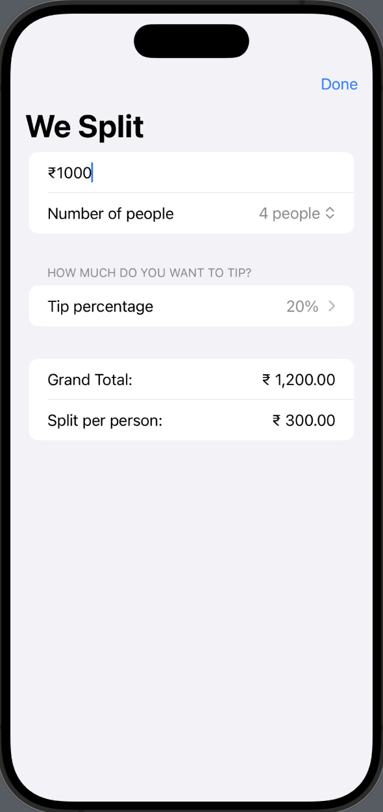

# WeSplit App

WeSplit is a simple and intuitive iOS app that helps you split the bill among friends. Enter the total amount, select the number of people, and choose the tip percentage to see the individual split and the total amount.

## Features

- Enter the total amount
- Select the number of people
- Choose the tip percentage
- View the total amount including tip
- View the amount each person needs to pay

## Screenshots

| Home Screen | Input Amount | Select Tip Percentage |
|-------------|--------------|-----------------------|
|  |  |  |

## How to Use

1. Enter the total amount in the "Amount" field.
2. Select the number of people using the picker.
3. Choose the tip percentage using the picker.
4. View the total amount including the tip and the amount each person needs to pay.

## Requirements

- iOS 14.0 or later
- Xcode 12.0 or later

## Installation

1. Clone the repository:
    ```sh
    git clone https://github.com/yourusername/WeSplit.git
    ```
2. Open the project in Xcode:
    ```sh
    cd WeSplit
    open WeSplit.xcodeproj
    ```
3. Build and run the app on your simulator or device.

## License

This project is licensed under the MIT License - see the [LICENSE](LICENSE) file for details.